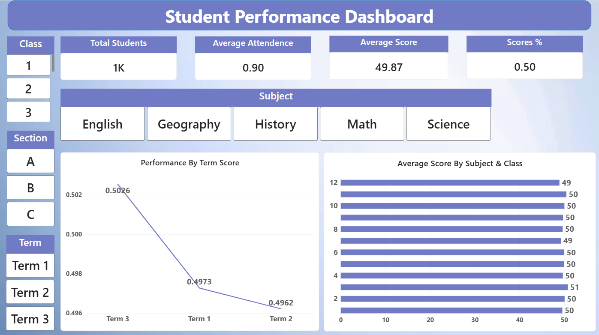
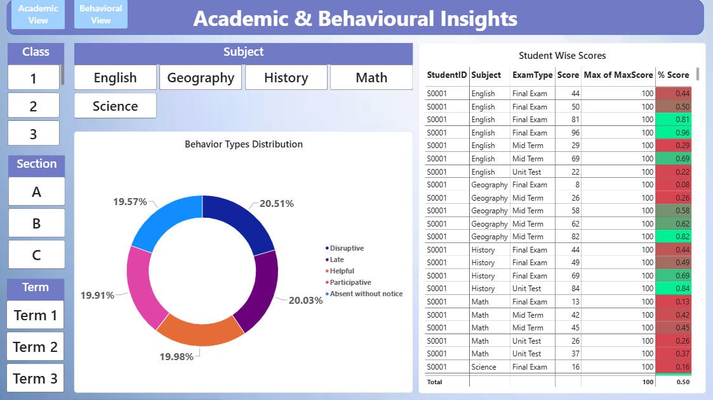

# 📊 Student Performance Dashboard – Power BI

An interactive **Power BI Student Performance Dashboard** designed to analyze academic performance, attendance, examination scores, and behavioral patterns. The dashboard provides an interactive view of student outcomes across **classes, sections, subjects, and terms**, helping educators and academic administrators make data-driven decisions.

---

## 📌 Dashboard Preview

## 📌 Dashboard Preview

### 🎓 Academic Performance View



### 🧠 Academic & Behavioural Insights



---
## 🎯 Project Objective

The main objective of this project is to transform student-related data into meaningful and interactive visual insights using Microsoft Power BI.

The dashboard helps users:

- Monitor overall student performance
- Analyze average scores across subjects
- Track performance across different terms
- Compare classes and sections
- Analyze student attendance
- Understand behavioral patterns
- Examine individual student scores
- Identify high- and low-performing areas
- Support data-driven academic decision-making

---

## 📊 Dashboard Features

### 1. 📈 Academic Performance Dashboard

The Academic View provides a high-level overview of student academic performance.

#### Key Performance Indicators

- **Total Students**
- **Average Attendance**
- **Average Score**
- **Scores %**

#### Interactive Analysis

- Class-wise filtering
- Section-wise filtering
- Subject-wise filtering
- Term-wise filtering
- Performance by term
- Average score by subject and class

---

### 2. 🧠 Behavioural Insights

The Behavioural View provides insights into student behavior and participation patterns.

The dashboard includes a **Behavior Types Distribution** visualization covering categories such as:

- Disruptive
- Late
- Helpful
- Participative
- Absent without notice

This helps educators understand overall behavioral patterns and identify areas that may require attention.

---

### 3. 👨‍🎓 Student-Level Analysis

The dashboard provides detailed student-level performance information.

The student performance table includes:

- Student ID
- Subject
- Exam Type
- Score
- Maximum Score
- Score Percentage

Conditional formatting is used to make performance levels easier to identify.

---

## 🎛️ Interactive Filters

The dashboard provides multiple filtering and navigation options:

| Filter | Purpose |
|---|---|
| **Class** | Analyze students by class |
| **Section** | Compare different sections |
| **Subject** | Analyze individual subjects |
| **Term** | Compare Term 1, Term 2 and Term 3 |
| **Academic View** | Focus on academic performance |
| **Behavioral View** | Focus on behavioral insights |

These interactive controls allow users to dynamically explore different aspects of student performance.

---
Student Performance Data
          ↓
     Data Cleaning
          ↓
     Data Modeling
          ↓
      DAX Measures
          ↓
 Interactive Visualizations
          ↓
 Academic & Behavioral Views
          ↓
   Student Performance Insights
   
------------------------------------------

   Student-Performance-Dashboard/
│
├── Student Performance Dashboard.pbix
├── README.md
│
├── Dashboard/
│   ├── Academic View.png
│   └── Behavioral View.png
│
└── Data/
    └── Student Performance Dataset

------------------------------------------

# 🔮 Future Enhancements

The Student Performance Dashboard can be further enhanced with advanced analytical features to provide deeper insights and improve decision-making.

### 📊 Attendance vs. Academic Performance
Add a scatter chart to analyze the relationship between student attendance and academic scores and identify whether attendance has an impact on performance.

### 🏆 Student Performance Ranking
Introduce student rankings based on overall score percentage, average marks, and attendance to identify high-performing students.

### ⚠️ At-Risk Student Identification
Develop a dedicated section to identify students with low scores, low attendance, or concerning behavioral patterns who may require additional academic support.

### 📈 Performance Trend Analysis
Add more detailed trend analysis to monitor individual and class-level performance across multiple terms and examinations.

### 🧠 Behavioural & Academic Correlation
Analyze the relationship between student behavioral patterns and academic performance to identify meaningful behavioral-performance trends.

### 💬 Interactive Tooltips
Create customized tooltip pages containing additional metrics, mini charts, and contextual information when users hover over dashboard visuals.

### 📋 Teacher & Class Performance Analysis
Add teacher-wise and class-wise analysis to compare academic outcomes and identify areas for improvement.

### 📊 Advanced KPI Metrics
Introduce additional KPIs such as:

- Highest Score
- Lowest Score
- Pass Percentage
- Attendance Percentage
- Number of At-Risk Students
- Top Performing Student
- Subject Pass Rate

### 🔔 Performance Alerts
Implement conditional indicators to highlight students or classes that fall below predefined academic or attendance thresholds.

### 📱 Dashboard Optimization
Optimize the dashboard layout for different screen sizes and Power BI Service/mobile viewing.

### 🤖 Predictive Performance Analysis
In future versions, predictive analytics could be introduced to identify students who may be at risk of underperforming based on historical academic, attendance, and behavioral data.

---

These enhancements can make the dashboard more comprehensive, interactive, and useful for **student monitoring, academic planning, and data-driven decision-making**.

    

## 📐 Key Metrics

The dashboard uses DAX measures to calculate important performance indicators.

### Scores %

```DAX
% Score =
DIVIDE(
    SUM('Scores'[Score]),
    SUM('Scores'[MaxScore]),
    0
)
